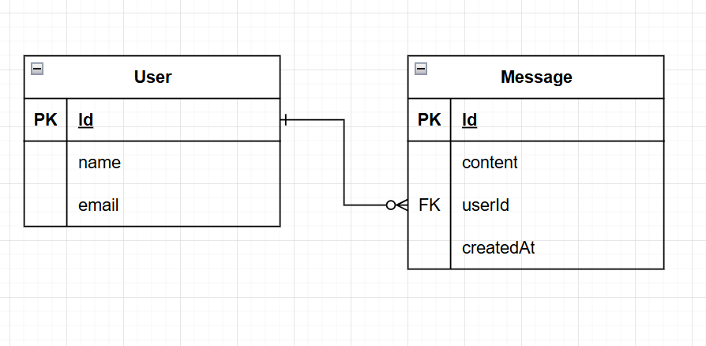

<p align="center">
  <a href="http://nestjs.com/" target="blank"></a>
</p>


# Prueba Técnica Backend - NestJS


## 📦 Tecnologías utilizadas

- [NestJS](https://nestjs.com/)
- [Prisma ORM](https://www.prisma.io/)
- [MySQL](https://www.mysql.com/)
- [class-validator](https://github.com/typestack/class-validator)
- [Joi](https://joi.dev/) 

---

## 🧱 Schema


<h3>Diagrama Entidad-Relación</h3>

<p>
  
</p>


### 🧑‍💻 `User`
- `id` (string, UUID)
- `name` (string)
- `email` (string, único)

### 💬 `Message`
- `id` (string, UUID)
- `content` (string)
- `createdAt` (DateTime)
- `userId` (string, UUID) → relación con `User`

---

## 📮 Endpoints disponibles

### `POST /users`
> Crear un nuevo usuario

**Body JSON:**
```json
{
  "name": "Juan Pérez",
  "email": "juan@test.com"
}
```


### `POST /messages`
> Crear un mensaje asociado a un usuario

**Body JSON:**
```json
{
  "content": "Hola mundo",
  "userId": "uuid del usuario"
}
```


### `GET /users/:id/messages`
> Obtener mensajes de un usuario con paginación

```
Query Params:

page (opcional, default: 1)

limit (opcional, default: 5)
```

**Ejemplos:**

``
GET /users/ef8c6ae5/messages
``

``
GET /users/ef8c6ae5/messages?page=2&limit=10
``

## 🛠️ Instalación y ejecución

1. Clona el repositorio: 
``
git@github.com:Kahyberth/prueba-tecnica.git
``

2. Instala dependencias: ``bun install`` o tambien ``npm install``

3. reenombra ``.env.example`` a ``.env``

4. Aplica migraciones:
`` npx prisma migrate dev --name init ``

5. Inicia el servidor: ``bun start:dev`` o ``npm run start:dev``


## Opcional

Se que en la prueba técnica mencionaban que no era necesario utilizar docker, pero en mi caso lo utilice solamente para facilitar el levantamiento de la base de datos MySQL. En caso de que se quiera utilizar el docker-compose, entonces seguir los siguientes pasos:

1. Es necesario tener instalado docker
2. Utilizar las variables de entorno necesarias para el docker-compose
3. Para levantar el contenedor utilizar: ``docker-compose up -d``


